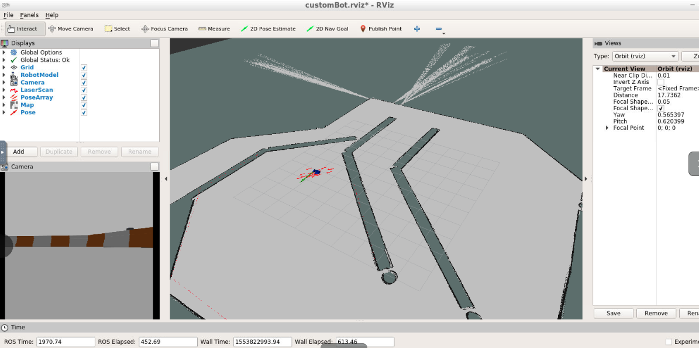

# ROS-Localization-Dynamic-Navigation-AMCL
Robotic simulation project using ROS (Robot Operating System), Gazebo, RViz simulation environment using AMCL.


## Project Description

Amcl (Adaptive Monte Carlo Localization) is a Robot Operating System (ROS) navigation package which utilizes particle filters to track the pose of a moving robot with a known 2D map. To test amcl's localization algorithm capabilities multiple robots were simulated using Gazebo and RViz where their movements were tracked and their ability to move toward a goal position was evaluated. 

## Running the Project

After completing the project, you can launch it by running the following commands first -

```bash
$ cd ~/catkin_ws
$ catkin_make
$ source devel/setup.bash
```

And then run the following in *separate* terminals -

``` bash
$ roslaunch udacity_bot udacity_bot
$ roslaunch udacity_bot amcl
$ rosrun udacity_bot navigation goal
```


http://wiki.ros.org/urdf/Tutorials/Building%20a%20Visual%20Robot%20Model%20with%20URDF%20from%20Scratch

Mobile Robot in Gazebo World with Environment Obstacles

<p align="center">  </p>

ClearPath Robotics Jackal Course to Test Localization and Navigation

<p align="center">  </p>

Custom Mobile Robot Successfully Reaches Navigation Goal

<p align="center">  </p>


I posted a successful navigation from origin to goal on youtube here:

[](https://www.youtube.com/watch?v=0Nag4b2GV2o)

